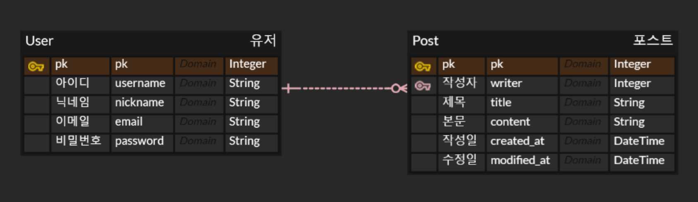
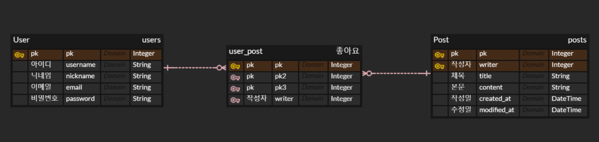

### 📌가상환경 생성
```bash
 python -m venv venv
 ```

 ### 📌가상환경 실행
 ```bash
 source venv/Scripts/activate
 ```

 ### 📌 Django 설치
 ```bash
 pip install django
 ```

### 📌 프로젝트 생성 
```bash
django-admin startproject djangoPrj .
```
* 뒤에 .을 붙일 경우 : 현재 디렉토리 내에 새 Django 프로젝트를 생성
* 뒤에 .을 붙이지 않을 경우 : 프로젝트 디렉토리를 만들고, 해당 프로젝트 디렉토리 안에 새로운 Django 프로젝트를 생성


### 📌 서버 돌리기
```bash
python manage.py runserver
```

### 📌 앱 생성
```bash
python manage.py startapp posts
```
* `settings.py`의 `INSTALLED_APPS`에 등록한 앱 추가

#### 💫 앱 생성 시 진행해야 하는 절차
* url 연결
    ```python
    path('', include('posts.urls')), # '' 경로에 posts/urls.py와 연결 
    ```
* 앱 내 메서드 생성, 구체적인 로직 작성 
* templates 폴더를 만든 후 view에서 지정한 템플릿 생성 (index.html)
* 앱 내 urls.py 생성 및 view 연결
    ```python
    from django.urls import path
    from .views import *; # 현재 경로 views.py의 모든 메서드를 불러옴 

    urlpatterns = [
        path('', index, name = "index"),
    ]
    ```
### 📌 SuperUser 생성
```bash
 python manage.py createsuperuser
```

### 📌 Model 작성
* 앱 내 models.py에 작성
  ```python
  class <모델명>(models.Model):
    # 필드 작성
  ```
* 모델을 정의한 후 데이터베이스에 모델 반영
  ```bash
  python manage.py makemigrations
  python manage.py migrate
  ```

### 📌 admin 등록
```python
admin.site.register(<모델명>)
```

* admin 페이지에 보일 내용 수정
```python
def __str__(self):
    return f'[{self.id}] {self.title}' # self.필드명
```

### 📌 CBV vs FBV
```python
# fbv posts 목록 페이지
def fbv_list(request):
    # Post의 모든 데이터를 id가 큰 순으로 가져옴
    posts = Post.objects.all().order_by('-id')

    # posts 라는 이름으로 list.html에서 사용 
    return render(request, 'posts.html', {'posts':posts})

# cbv posts 목록 페이지
class cbv_list(ListView):
    model = Post 
    ordering = '-id'
```

#### 💫 cbv 방식 주의점
* 기능에 맞는 view 임포트 필요 
    ```python
    from django.views.generic import ListView, DetailView
    ```
* url 연결 시 as_view() 작성 
    ```python
    path('posts-cbv/', cbv_list.as_view(), name = "posts-cbv"),
    ```
* list
    * `앱명/모델명_list.html`
    * `모델명_list` 로 쿼리 사용 (ex )
* detail
    * `앱명/모델명_detail.html`
    * `모델명` 로 쿼리 사용 (ex )

### 📌 로그인 & 회원가입 & 로그아웃

#### 💫 User 모델 생성
* `AbstractUser`을 상속받은 User 모델 생성
    * 기본적으로 username, password 필드를 가지고 있기 때문에 내가 원하는 필드만 추가
* 장고에서 기본 유저로 인식하기 위해 아래 코드 추가
    ```python
    AUTH_USER_MODEL = "users.User"
    ```

#### 💫 회원가입
* forms.py 내에 `UserCreationForm`을 상속받은 폼 생성 후 사용
    ```python
    class SignUpForm(UserCreationForm):
        class Meta(): # Django에서 모델에 대한 추가적인 메타데이터를 제공
            model = # 폼이 연결된 모델 지정 
            fields = # 폼에 표시될 필드를 지정
    ```

#### 💫 로그인
* `AuthenticationForm` 사용 
    ```python
    from django.contrib.auth.forms import AuthenticationForm
    ```

### 📌 다대일 - ForeignKey
```python
writer = models.ForeignKey(get_user_model(), on_delete=models.CASCADE) # User 다대일 관계 
```
* `on_delete` : ForeignKey 필드가 참조하는 객체가 삭제될 때 어떻게 동작할지를 지정
    * `models.CASCADE`: 참조하는 객체가 삭제될 때, 해당 객체와 연결된 모든 객체도 함께 삭제
    * `models.PROTECT`: 참조하는 객체가 삭제될 때, 참조하는 객체와 연결된 객체가 있는 경우 삭제를 방지
    * `models.SET_NULL`: 참조하는 객체가 삭제될 때, 해당 필드를 NULL로 설정 (해당 필드가 null을 허용해야 함)
    * `models.SET_DEFAULT`: 참조하는 객체가 삭제될 때, 기본값으로 설정된 값으로 필드를 설정
    * `models.SET()`: 참조하는 객체가 삭제될 때, 특정 함수를 실행하여 값을 설정



### 📌 다대다 - ManyToMany
```python
likes = models.ManyToManyField(get_user_model(), related_name="post_like") # User 다대다 관계 
```
* post.likes 를 통해 post_user 중간 테이블 참조 
* `related_name` : 역참조를 위한 이름을 지정 ( user.post_like를 통해 post_user 중간 테이블 참조 )
* `through` : ManyToMany 관계에 대한 중간 모델을 지정



```python
if request.user in post.likes.all()
```
* `post.likes`는 ManyToManyField의 관련 매니저 객체이므로 `request.user in post.likes`로 확인할 수 없음
* `post.likes.all()`을 사용하여 ManyToManyField에 연결된 모든 사용자를 가져와 해당 사용자가 이미 좋아요를 했는지 확인해야 함 

### 📌 정적 경로 및 미디어 파일 경로
```python
import os
MEDIA_URL = '/media/'
MEDIA_ROOT=os.path.join(BASE_DIR, '_media')
```
```python
from django.contrib import admin
from django.urls import path, include
from django.conf import settings
from django.conf.urls.static import static
urlpatterns = [
    path('admin/', admin.site.urls),
]+static(settings.MEDIA_URL, document_root=settings.MEDIA_ROOT)
```